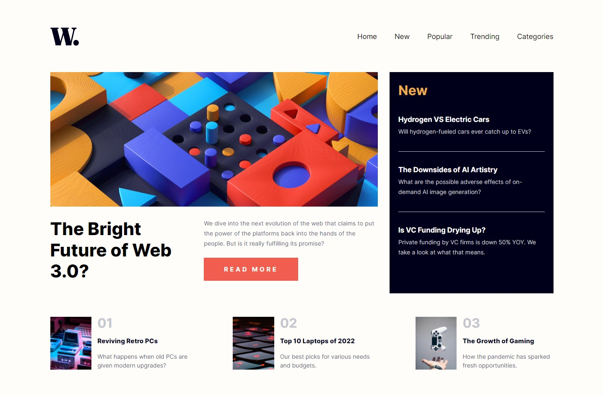
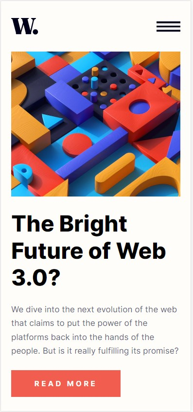
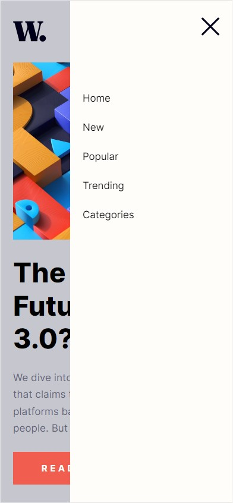

# Frontend Mentor - News homepage solution

This is a solution to the [News homepage challenge on Frontend Mentor](https://www.frontendmentor.io/challenges/news-homepage-H6SWTa1MFl).  

## Table of contents

- [Overview](#overview)
  - [The challenge](#the-challenge)
  - [Screenshot](#screenshot)
  - [Links](#links)
- [My process](#my-process)
  - [Built with](#built-with)
  - [Continued development](#continued-development)

## Overview

### The challenge

Users should be able to:

- View the optimal layout for the interface depending on their device's screen size
- See hover and focus states for all interactive elements on the page

### Screenshot

### Links

- Solution URL: [https://github.com/olha-bochevar/news-homepage-main](https://github.com/olha-bochevar/news-homepage-main)
- Live Site URL: [https://olha-bochevar.github.io/news-homepage-main/](https://olha-bochevar.github.io/news-homepage-main/)

## My process

### Built with

- Semantic HTML5 markup
- BEM metodology
- CSS custom properties
- Flexbox
- CSS Grid
- Mobile-first workflow

### Continued development

Need more practice with @font-face and making layout with CSS Grid and Mobile-first method. 

